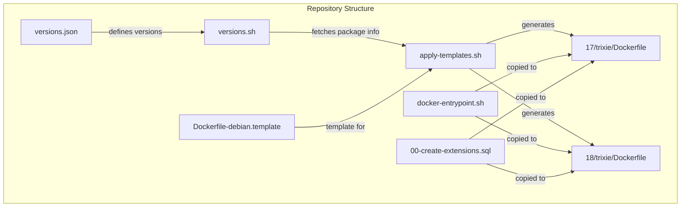
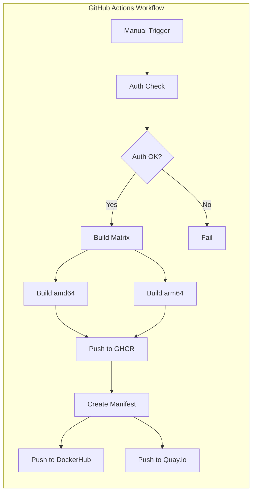
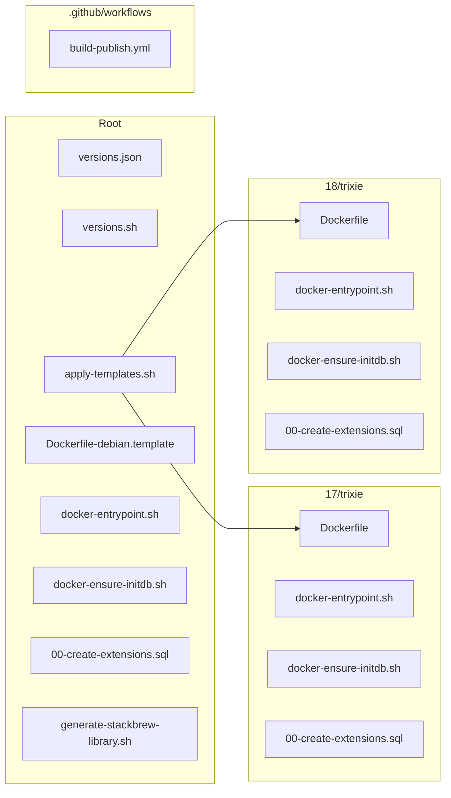

# PostgreSQL Docker Images with Extensions

[](https://github.com/mlshdev/postgres/actions/workflows/build-publish.yml)

This repository provides PostgreSQL Docker images built on **Debian Trixie (slim)** with a comprehensive set of pre-installed extensions. Images are built for **linux/amd64** and **linux/arm64** architectures and published to multiple container registries.

## Supported Versions

| PostgreSQL Version | Base Image | Architectures |
|-------------------|------------|---------------|
| 18.1 | debian:trixie-slim | amd64, arm64 |
| 17.7 | debian:trixie-slim | amd64, arm64 |

## Quick Start

```bash
# Pull from GHCR
docker pull ghcr.io/mlshdev/postgres:18

# Pull from DockerHub  
docker pull docker.io/mlshdev/postgres:18

# Pull from Quay.io
docker pull quay.io/mlshdev/postgres:18

# Run with password
docker run -d \
  --name postgres \
  -e POSTGRES_PASSWORD=mysecretpassword \
  -p 5432:5432 \
  ghcr.io/mlshdev/postgres:18
```

## Available Image Tags

- `18`, `18.1`, `latest` - PostgreSQL 18
- `17`, `17.7` - PostgreSQL 17
- `18-trixie`, `17-trixie` - Explicit Debian Trixie variant tags

## Pre-installed Extensions

This image comes with **70+ PostgreSQL extensions** pre-installed and ready to use. Extensions requiring `shared_preload_libraries` are automatically configured.

### Core Extensions (from postgresql-contrib)

| Extension | Description |
|-----------|-------------|
| `pg_stat_statements` | Track planning and execution statistics of SQL statements |
| `pgcrypto` | Cryptographic functions |
| `hstore` | Key-value store data type |
| `pg_trgm` | Text similarity and index searching based on trigrams |
| `fuzzystrmatch` | Determine similarities between strings |
| `citext` | Case-insensitive character string type |
| `uuid-ossp` | Generate UUIDs |
| `intarray` | Functions and operators for 1-D arrays of integers |
| `cube` | Multidimensional cube data type |
| `earthdistance` | Calculate great-circle distances |
| `bloom` | Bloom filter access method |
| `btree_gin` / `btree_gist` | B-tree indexed GIN/GiST operator classes |
| `postgres_fdw` | Foreign data wrapper for remote PostgreSQL |
| `dblink` | Connect to other PostgreSQL databases |

### Scheduling & Job Management

| Extension | Description |
|-----------|-------------|
| `pg_cron` | Run periodic jobs in PostgreSQL (preloaded) |
| `pg_partman` | Partition management for time-based and serial partitioning |

### Auditing & Security

| Extension | Description |
|-----------|-------------|
| `pgaudit` | Session and object audit logging (preloaded) |
| `credcheck` | PostgreSQL username/password checks |

### Performance & Monitoring

| Extension | Description |
|-----------|-------------|
| `pg_stat_kcache` | Gather statistics about physical I/O (preloaded) |
| `pg_qualstats` | Statistics about predicates (preloaded) |
| `pg_wait_sampling` | Wait events sampling |
| `hypopg` | Hypothetical indexes for testing |
| `pg_repack` | Reorganize tables without locks |
| `show_plans` | Show execution plans of running queries |

### Vector/AI Extensions

| Extension | Description |
|-----------|-------------|
| `pgvector` | Vector similarity search |

### Geospatial Extensions

| Extension | Description |
|-----------|-------------|
| `postgis` | Geographic object support |
| `postgis_topology` | PostGIS topology support |
| `postgis_raster` | PostGIS raster support |
| `pgrouting` | Geospatial routing functionality |
| `h3` | H3 hexagonal hierarchical geospatial indexing |

### Data Types & Utilities

| Extension | Description |
|-----------|-------------|
| `hll` | HyperLogLog data type |
| `ip4r` | IPv4/IPv6 range types |
| `prefix` | Prefix matching for text |
| `semver` | Semantic version data type |
| `unit` | SI units for PostgreSQL |
| `pgmp` | Multiple precision arithmetic |

### Foreign Data Wrappers

| Extension | Description |
|-----------|-------------|
| `mysql_fdw` | Foreign data wrapper for MySQL |
| `ogr_fdw` | OGR foreign data wrapper for various formats |
| `redis_fdw` | Foreign data wrapper for Redis |

### Replication & CDC

| Extension | Description |
|-----------|-------------|
| `wal2json` | JSON output plugin for logical decoding |
| `decoderbufs` | Protocol Buffers output plugin |
| `pglogical` | Logical replication |

### Full-text Search

| Extension | Description |
|-----------|-------------|
| `rum` | RUM index for full-text search |

## Configuration

### Shared Preload Libraries

The following extensions are automatically preloaded via `shared_preload_libraries`:

```
shared_preload_libraries = 'pg_cron,pg_stat_statements,pgaudit,pg_stat_kcache,pg_qualstats'
```

### pg_cron Configuration

```
cron.database_name = 'postgres'
```

### pg_stat_statements Configuration

```
pg_stat_statements.track = all
pg_stat_statements.max = 10000
```

## Using Extensions

Extensions are automatically created on first database initialization. To manually create an extension:

```sql
CREATE EXTENSION IF NOT EXISTS pgvector;
CREATE EXTENSION IF NOT EXISTS postgis;
CREATE EXTENSION IF NOT EXISTS pg_cron;
```

## Architecture



## Build Process



## File Structure



## Container Registries

Images are published to:

| Registry | Image |
|----------|-------|
| GitHub Container Registry | `ghcr.io/mlshdev/postgres` |
| DockerHub | `docker.io/mlshdev/postgres` |
| Quay.io | `quay.io/mlshdev/postgres` |

## OCI Compliance

All images are built with OCI-compliant labels:

```dockerfile
LABEL org.opencontainers.image.title="PostgreSQL"
LABEL org.opencontainers.image.description="PostgreSQL ${VERSION} Database Server with Extensions"
LABEL org.opencontainers.image.version="${VERSION}"
LABEL org.opencontainers.image.licenses="PostgreSQL"
LABEL org.opencontainers.image.source="https://github.com/mlshdev/postgres"
LABEL org.opencontainers.image.vendor="PostgreSQL Community"
```

## Building Locally

```bash
# Clone the repository
git clone https://github.com/mlshdev/postgres.git
cd postgres

# Generate Dockerfiles from template
./apply-templates.sh

# Build PostgreSQL 18 image
docker build -t postgres:18 ./18/trixie/

# Build PostgreSQL 17 image
docker build -t postgres:17 ./17/trixie/
```

## Docker Compose Example

```yaml
version: '3.8'

services:
  postgres:
    image: ghcr.io/mlshdev/postgres:18
    container_name: postgres
    environment:
      POSTGRES_USER: myuser
      POSTGRES_PASSWORD: mypassword
      POSTGRES_DB: mydb
    ports:
      - "5432:5432"
    volumes:
      - postgres_data:/var/lib/postgresql
    healthcheck:
      test: ["CMD-SHELL", "pg_isready -U myuser -d mydb"]
      interval: 10s
      timeout: 5s
      retries: 5

volumes:
  postgres_data:
```

## Kubernetes Deployment Example

```yaml
apiVersion: apps/v1
kind: Deployment
metadata:
  name: postgres
spec:
  replicas: 1
  selector:
    matchLabels:
      app: postgres
  template:
    metadata:
      labels:
        app: postgres
    spec:
      containers:
        - name: postgres
          image: ghcr.io/mlshdev/postgres:18
          ports:
            - containerPort: 5432
          env:
            - name: POSTGRES_USER
              value: myuser
            - name: POSTGRES_PASSWORD
              valueFrom:
                secretKeyRef:
                  name: postgres-secret
                  key: password
            - name: POSTGRES_DB
              value: mydb
          volumeMounts:
            - name: postgres-storage
              mountPath: /var/lib/postgresql
      volumes:
        - name: postgres-storage
          persistentVolumeClaim:
            claimName: postgres-pvc
```

## Contributing

1. Fork the repository
2. Create your feature branch (`git checkout -b feature/amazing-feature`)
3. Commit your changes (`git commit -m 'Add amazing feature'`)
4. Push to the branch (`git push origin feature/amazing-feature`)
5. Open a Pull Request

## License

This project is licensed under the PostgreSQL License - see the [LICENSE](LICENSE) file for details.

## Acknowledgments

- [PostgreSQL Global Development Group](https://www.postgresql.org/)
- [Docker Library postgres](https://github.com/docker-library/postgres)
- All extension maintainers and contributors
